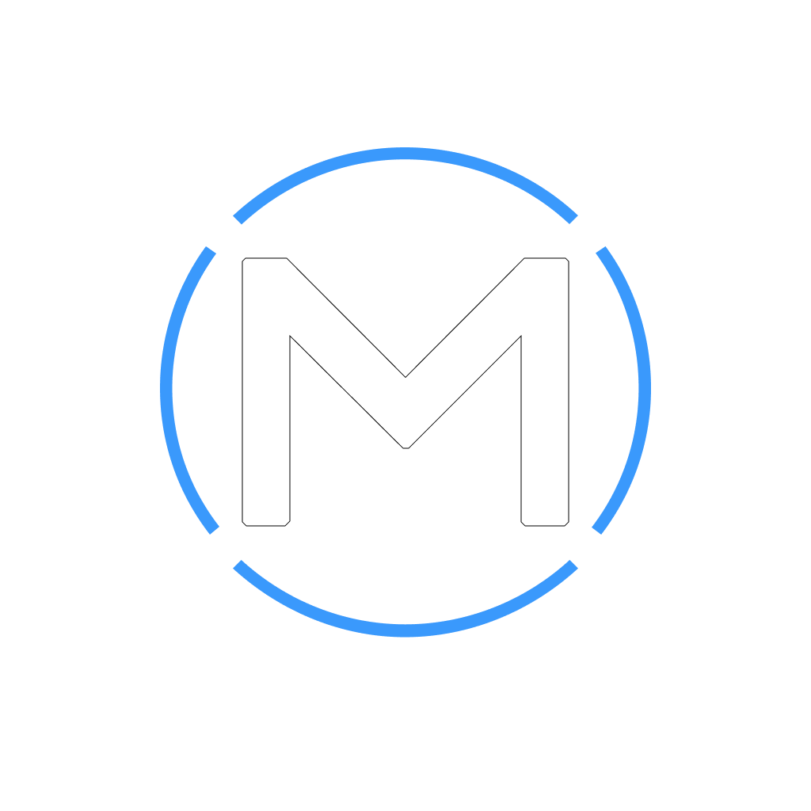

<!-- Background Wrapper to emulate dark theme across environments -->

  <!-- Centered Brand Logo Asset from Repository Root -->
  

  <!-- Main Display Header -->
  <h1 style="font-family: 'Orbitron', -apple-system, sans-serif; color: #ffffff; font-size: 2.2em; font-weight: 800; letter-spacing: 2px; margin-top: 0; text-transform: uppercase;">
    ModmanTV
  </h1>

  <!-- Subtle Horizontal Divider Accent -->
  

  <!-- Left-aligned responsive text container block -->
  

This is the official website for Modman — a collection of apps, projects, and creative work.

## About

Modman is where I build and share things I'm working on, learning, or experimenting with.

From mobile apps like *My Weight Diary* to content, tools, and future projects, everything connects here.

## What You'll Find
 📱 Apps and tools
 💻 Development projects
 🎥 YouTube content
 🧠 Experiments and ideas
 🚀 Ongoing and future builds

## Philosophy

No strict niche — just building, improving, and sharing the process.

If it's something I'm working on, it belongs here.

---

Visit the live site:
https://ModmanTV.github.io

  

